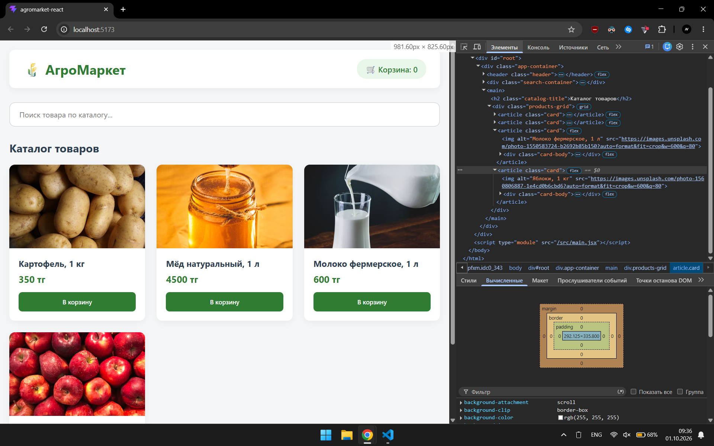
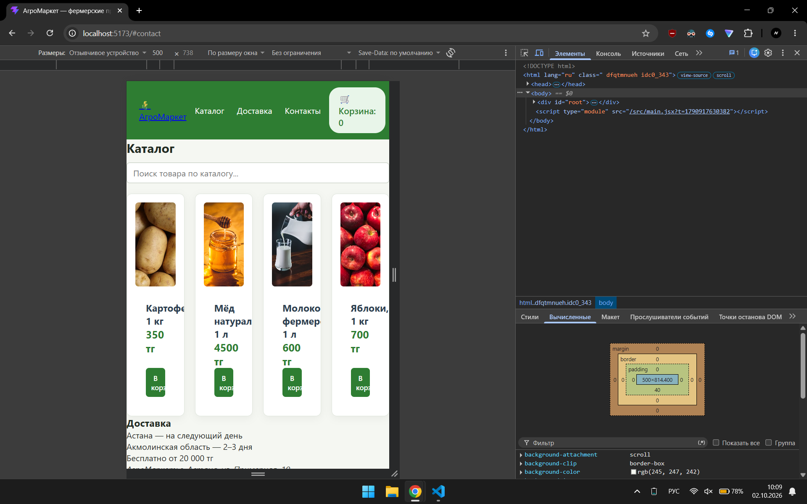
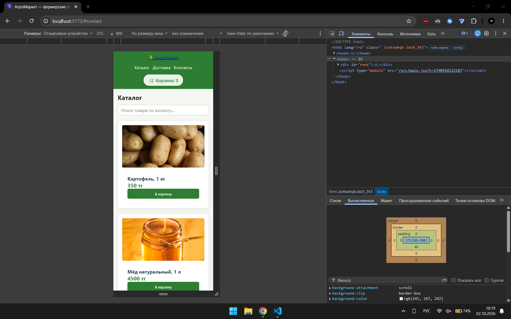
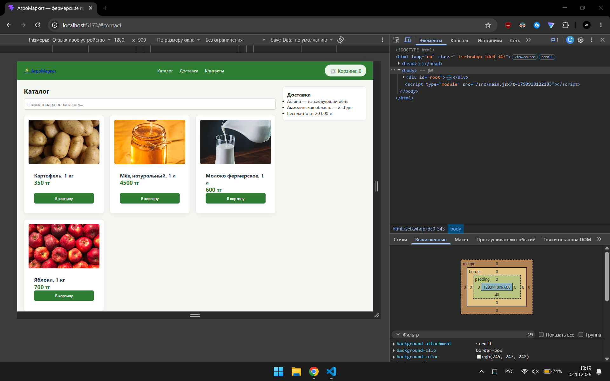
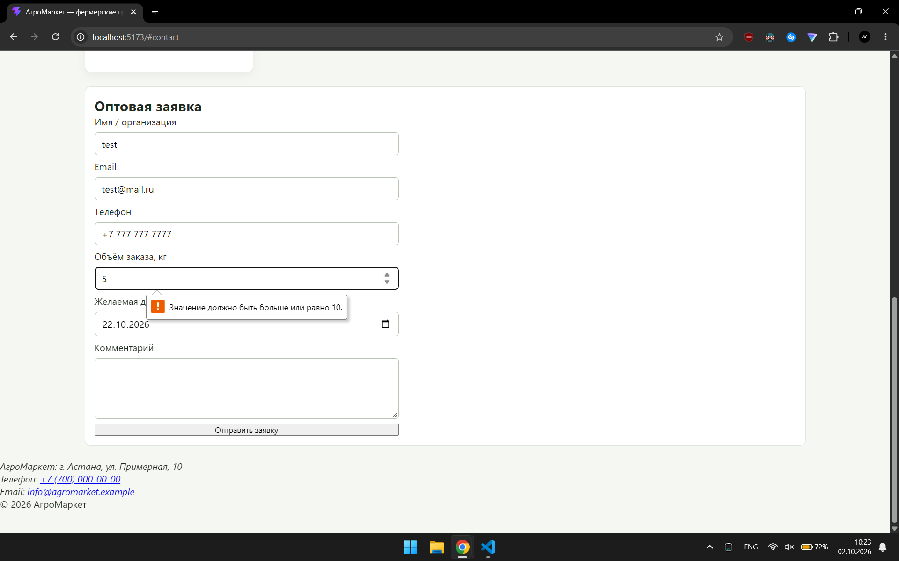
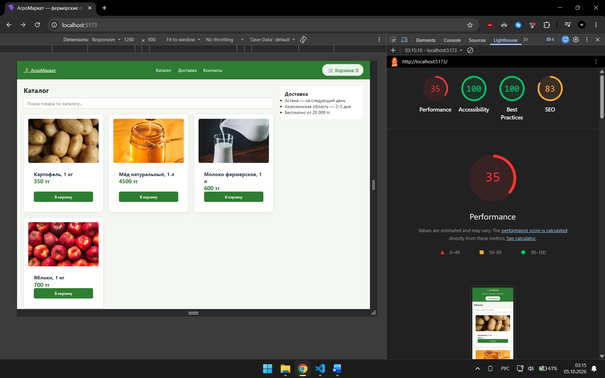

# React + Vite

This template provides a minimal setup to get React working in Vite with HMR and some ESLint rules.

Currently, two official plugins are available:

- [@vitejs/plugin-react](https://github.com/vitejs/vite-plugin-react/blob/main/packages/plugin-react) uses [Oxc](https://oxc.rs)
- [@vitejs/plugin-react-swc](https://github.com/vitejs/vite-plugin-react/blob/main/packages/plugin-react-swc) uses [SWC](https://swc.rs/)

## React Compiler

The React Compiler is not enabled on this template because of its impact on dev & build performances. To add it, see [this documentation](https://react.dev/learn/react-compiler/installation).

## Expanding the ESLint configuration

If you are developing a production application, we recommend using TypeScript with type-aware lint rules enabled. Check out the [TS template](https://github.com/vitejs/vite/tree/main/packages/create-vite/template-react-ts) for information on how to integrate TypeScript and [`typescript-eslint`](https://typescript-eslint.io) in your project.

## Лабораторная 4 — вёрстка

### 1. Box model карточки

- content: 292.125 px
- padding: 0
- border: 0
- margin: 0
- итоговая ширина: примерно 292.125 px

При добавлении `box-sizing: border-box` ширина карточки не изменилась, потому что свойство уже применялось глобально через селектор `*`.



### 2. repeat(4, 1fr) на узком экране

При ширине около 500 px четыре фиксированные колонки становятся слишком узкими, карточки сжимаются, поэтому фиксированная сетка плохо подходит для адаптивной страницы.



### 3. auto-fit vs auto-fill

`auto-fit` схлопывает пустые колонки и позволяет существующим карточкам занимать освободившееся место.

`auto-fill` сохраняет место под возможные пустые колонки.

В проекте оставлен `auto-fit`.

### 4. Адаптивность

| Ширина | Колонок в каталоге | Где «Доставка» | Шапка |
|--------|---------------------|----------------|-------|
| 375 px | 1 | Под каталогом | Столбик |
| 768 px | 2–3 | Под каталогом | Ряд |
| 1280 px | Несколько колонок | Справа от каталога | Ряд |

#### 375 px



#### 1280 px



### 5. HTML5-валидация формы

Форма использует:

- `type="text"`;
- `type="email"`;
- `type="tel"`;
- `type="number"`;
- `type="date"`;
- `required`;
- `min="10"`.

Браузер автоматически блокирует отправку при некорректном email и при объёме заказа меньше 10 кг.



### 6. Что реализовано

- Семантические `header`, `nav`, `main`, `section`, `aside`, `footer`;
- отдельные компоненты `Header`, `Footer`, `ContactForm`;
- Flexbox для шапки, панели каталога и карточек;
- CSS Grid для каталога;
- `repeat(auto-fit, minmax(220px, 1fr))`;
- featured-карточка «Товар недели»;
- адаптивность mobile-first;
- media queries для 768px и 1024px;
- форма оптовой заявки;
- HTML5-валидация.

### 7. Запуск проекта

Команды выполняются из корня проекта.

Терминал 1:

```bash
npx json-server --watch db.json --port 3001
```

Терминал 2:

```bash
npm run dev
```

После этого проект открывается на: [http://localhost:5173](http://localhost:5173).

### Lighthouse Accessibility

Первичная проверка Lighthouse показала:

- Accessibility: 96/100
- замечание: недостаточный контраст текста и фона.

После корректировки цветов и повторной проверки:

- Accessibility: 100/100

Проблема контраста была устранена без изменения структуры страницы.



### Бонусные задания

Выполнено:

- Lighthouse Accessibility — 100/100;
- макет `.page` переписан через `grid-template-areas`;
- боковая панель «Доставка» на десктопе сделана `sticky`;
- шапка сделана `sticky`.
