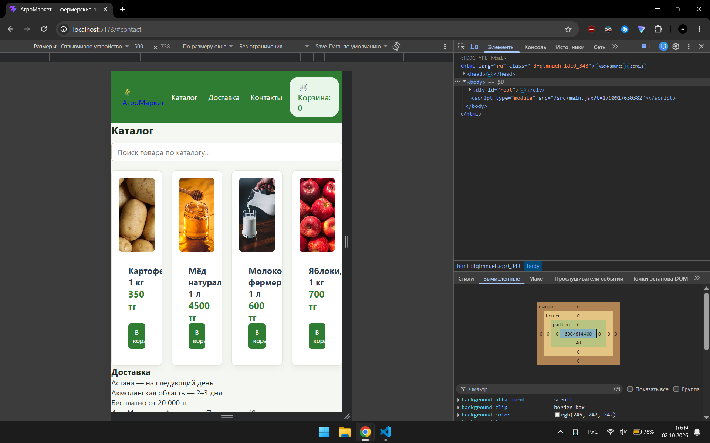
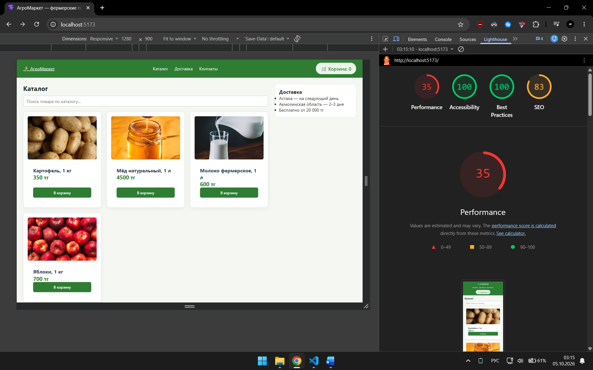
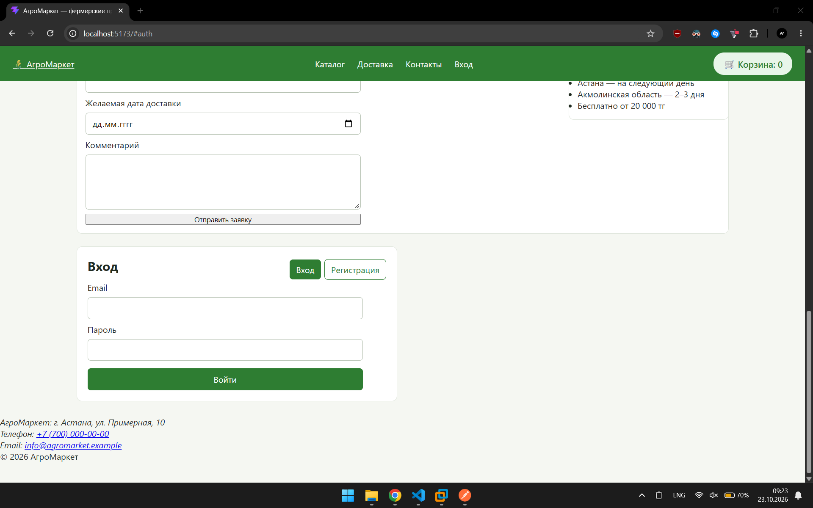
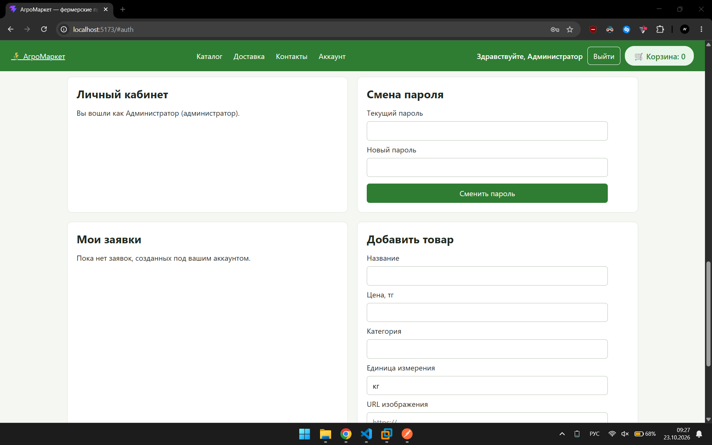

# АгроМаркет — React + Vite

## ЛР12, этап 2 — E2E и страница товара

Актуальные правила этого раздела заменяют инструкции запуска E2E из исторических разделов ниже.
Карточка ссылается на `/products/:id`. Страница запрашивает `GET /api/products/:id`,
показывает название и цену, ошибку загрузки и ссылку обратно в каталог. Переход выполняется
обычной ссылкой, без новой зависимости маршрутизации; на хостинге требуется существующий SPA rewrite.

### Локальное тестовое окружение

Полный E2E разрешён только с локальными frontend и API и отдельной непроизводственной БД.
Backend этим этапом не изменяется и автоматически не запускается. Перед запуском нужно
подготовить отдельную тестовую БД, применить к ней схему и тестовые данные, затем запустить
локальный backend именно с этой БД. Не используйте рабочую БД и туннели к production.

Создайте локально игнорируемый `.env.e2e`. Имена необходимых параметров:

- `E2E_BASE_URL` — HTTP loopback URL frontend с корневым путём;
- `E2E_API_URL` — HTTP loopback URL backend с путём `/api`, на другом origin;
- `E2E_TEST_DATABASE_NAME` — имя отдельной БД формата `agromarket_*test*`;
- `E2E_TEST_DATABASE_CONFIRMED` — установите `yes` только после проверки, что запущенный backend использует эту БД.

Эта декларация не является техническим доказательством подключения backend к указанной БД:
frontend не имеет доступа к соединению PostgreSQL. Проверка фактической конфигурации backend
остаётся обязательным предварительным условием. Не подтверждайте её по одному адресу API.

Данные `.env.e2e` читаются в Node-процессе Playwright. В frontend передаётся только публичный
адрес локального API. Учётные данные seed, когда он будет уточнён, должны храниться только
в `.env.e2e`, без префикса `VITE_`; значения не добавляйте в README, тесты и Git.
Разрешены только четыре перечисленных параметра окружения и зарезервированные имена
`E2E_FARMER_EMAIL`, `E2E_FARMER_PASSWORD`. Все `VITE_*` и неизвестные ключи отклоняются до запуска.
Ошибка не выводит значения. Launcher Vite отключает чтение env-файлов (`envDir: false`),
очищает унаследованное окружение и задаёт только проверенный публичный `VITE_API_URL`.
Унаследованные `NODE_OPTIONS`, `DEBUG`, proxy и Playwright overrides не передаются дочерним процессам.
Проверить правило игнорирования можно командой `git check-ignore .env.e2e`.

После подготовки окружения:

```bash
npm run schemas:sync
npm run e2e
```

Playwright запускает новый Vite с локальным API; повторное использование неизвестного dev-сервера
запрещено. Существующие каталоговые и мобильные проверки сохранены. Добавлены переход из реального
локального каталога, регистрация с уникальным email на основе `Date.now()` и UUID, проверка имени,
а также независимый тест неправильного пароля с собственным зарегистрированным пользователем.
Сценарии создают пользователей, а сохранённый сценарий покупателя — ещё и заявку.
После прогона сбрасывайте только выделенную тестовую БД средствами тестового окружения.
Автоматического удаления пользователей и заявок через публичный API нет.

Запросы локального прогона ограничены выбранными loopback origin; запись разрешена только в
выбранный `/api`. Внешние запросы, включая изображения, блокируются; заблокированные API-запросы
и переходы приводят к ошибке теста. Redirect не может перенести запрос записи во внешний API.
Service workers отключены. Каждый тест получает новый browser context.
WebSocket блокируется; HMR тестового Vite отключён. Диагностический локальный прогон имеет
доступ только к каталогу/категориям API методами чтения. Доступ к auth и запись доступны только
выделенному чувствительному прогону с отключёнными диагностическими записями.
Runner запускает фиксированный конфиг двумя последовательными процессами: диагностическим и
чувствительным. Произвольные CLI-аргументы (включая `--config`, `--reporter`, `--project`, `--list`)
запрещены. Это защита штатных команд запуска, а не песочница для произвольного Node-кода:
не добавляйте обходные запросы через Node fetch/APIRequestContext в тесты.

### Production smoke

```bash
npm run e2e:smoke
```

Требуется переменная процесса `BASE_URL` или `PRODUCTION_URL` с HTTPS-адресом опубликованного сайта;
если заданы обе, используется `BASE_URL`.
Допускается только корневой URL без credentials, query-параметров и fragment, чтобы токены из URL
не попадали в отчёты.
Запускаются ровно два desktop smoke: главная/реальный каталог и переход из карточки на страницу
товара с проверкой названия. Ответы каталога не подменяются. Методы записи блокируются сетевым
fixture. Auth и создающие данные сценарии не входят в production-проект. До публикации страницы
товара второй smoke закономерно не пройдёт.

Workflow `.github/workflows/e2e.yml` запускает только этот проект вручную, по расписанию
и после успешного `deployment_status`, используя `target_url` конкретного deployment,
включая Preview. Доступность Preview и его API зависит от защиты deployment и CORS backend.
Возможность запускать регистрацию/заказы против произвольного удалённого URL удалена.

### Отчёты и проверки

### Visual regression ProductCard

`npm run e2e:visual` сравнивает карточку с сохранённым baseline на локальном
frontend в проекте `visual-chromium`. Для запуска нужна обычная `.env.e2e`;
каталог подменяется фиктивным товаром, пользовательские данные не используются.
Тест фиксирует viewport, ждёт шрифты и изображение и отключает анимации.
Baseline хранится в `e2e/product-card.visual.spec.js-snapshots/` с суффиксом
платформы Playwright; сравнивать нужно в той же ОС и версии браузера, в которой
он создан. При ошибке `expected`, `actual` и `diff` находятся в `test-results/`
и доступны в диагностическом HTML-отчёте `playwright-report/lab12/<UUID>/diagnostic/`.
После намеренного изменения CSS сначала проверьте различия, затем выполните
`npm run e2e:visual:update` и просмотрите изменившийся PNG перед включением в Git.
Обычный запуск baseline не обновляет.

В diagnostic-фазе Playwright проверяет axe-core на главной и `/login` в Chromium
и профиле Pixel 7 по автоматизированным правилам WCAG 2.1 A/AA. Каталог для этих
проверок подменён фиктивным товаром, данные пользователей не используются. В текущем
приложении `/login` отображает общий экран с формой входа. Нулевой результат axe
не заменяет ручной проверки доступности.

Каждая штатная команда получает новый UUID. Существующие отчёты не очищаются и не перезаписываются.
Диагностический HTML: `playwright-report/lab12/<UUID>/diagnostic/`; smoke HTML:
`playwright-report/lab12/<UUID>/smoke/`. Результаты находятся в соответствующих подкаталогах
`test-results/lab12/<UUID>/`. Для этих тестов screenshot создаётся только при ошибке,
trace — на первом повторе (`on-first-retry`), один повтор включён и локально.
Для просмотра: `npx playwright show-report playwright-report/lab12/<UUID>/diagnostic`.

Auth и сохранённый сценарий регистрации/заказа помечены `@sensitive` и выполняются отдельно.
Для farmer отдельный setup один раз входит через UI и сохраняет storageState во временном
игнорируемом каталоге `.playwright-auth/<UUID>/`. Оба farmer-теста используют это состояние;
runner удаляет папку запуска после завершения sensitive-фазы, в том числе при ошибке тестов.
Файл содержит JWT: при аварийном завершении процесса его необходимо удалить вручную, если
папка запуска осталась. Не прикладывайте этот каталог к отчётам или артефактам CI.
Для них trace, screenshot и video выключены; HTML/JSON/blob reporters не подключены.
Ошибки обезличиваются без изменения результата assertions, вложения исключаются, автоматический
снимок страницы подавляется. Если Playwright создаёт `error-context.md`, он содержит только
обезличенную ошибку и исходный код теста без значений runtime-переменных. Используется
`PLAYWRIGHT_NO_COPY_PROMPT`, проверенный в установленной версии Playwright 1.65.0; после обновления
чувствительный запуск блокируется до повторного аудита механизма и обновления допуска версии.
Не добавляйте ручные screenshot/trace/attachments
или секретные литералы в тесты. Ограниченный репортёр не сохраняет call logs, сообщения браузера,
ошибки и значения переменных. Runner дополнительно подавляет весь stdout/stderr чувствительного
процесса, включая ошибки запуска, и показывает только общий результат.

Workflow загружает только каталоги `*/smoke/`, хранит их 7 дней. Локальные результаты не
публикуются; старые артефакты автоматически не обезличиваются. Каталоги отчётов и `.env.e2e`
исключены из Git. Храните их на локальном диске в профиле пользователя с доступом только владельцу,
вне общих/синхронизируемых папок. Не отправляйте архивы старых auth-прогонов.
Для очистки закройте report viewer и тестовые процессы, откройте `playwright-report/lab12/`
и `test-results/lab12/`, проверьте конкретный UUID и удалите вручную только выбранные каталоги
завершённого прогона. Не используйте рекурсивное удаление корня проекта. Ничего не удаляется
командами реализации этого этапа.

Проверка ограничений без браузера и сети: `node --test e2e/environment.test.js`.

### Подтверждение фактической тестовой БД перед E2E

`/api/health` выполняет только `SELECT 1`: ответ connected не доказывает изоляцию БД.
Backend берёт подключение из `DATABASE_URL`. Существующая документация и test guard backend
ориентированы на `agromarket_test` на локальном PostgreSQL или учебной VM.
Состояние реальной БД в этом этапе не проверялось: подключения, seed и миграции не запускались.

1. Подготовьте отдельно конфигурационный файл backend `.env.test` с `NODE_ENV=test`, отдельным
   тестовым `DATABASE_URL`, тестовыми ключами backend, отдельным свободным портом и CORS для
   loopback frontend. Значения не помещайте в командную строку/скриншоты/репозиторий. Убедитесь,
   что файл исключён из Git. Если БД или схема ещё не подготовлены, остановитесь: создание БД,
   её прав и схемы требует отдельного согласования; `db:init` сбрасывает тестовую схему.
2. Используйте отдельный терминал без унаследованных `DATABASE_URL`, `JWT_SECRET`,
   `LOGIN_ATTEMPT_SECRET`, `PORT`, `CORS_ORIGIN`, `DOTENV_CONFIG_PATH` и `DOTENV_CONFIG_OVERRIDE`:
   `--env-file` не переопределяет уже заданные переменные процесса. Не выводите окружение.
   Остановите свой старый локальный backend, если он занимает выбранный порт. Не направляйте E2E
   на неизвестный процесс. В отдельном PowerShell из каталога `agromarket-server` выполните
   приведённую ниже проверку. Она не выводит URL, пользователя или пароль и использует read-only
   транзакцию. При успехе запускается backend в том же процессе с тем же объектом pool — так
   проверяется подключение именно запускаемого backend, а не произвольного SQL-клиента.

```powershell
@'
let pool;
try {
  if (process.env.NODE_ENV !== 'test') throw new Error();
  const url = new URL(process.env.DATABASE_URL);
  if (!['postgres:', 'postgresql:'].includes(url.protocol) ||
      decodeURIComponent(url.pathname.slice(1)) !== 'agromarket_test' ||
      !['localhost', '127.0.0.1', '[::1]', '192.168.174.10'].includes(url.hostname) ||
      Number(url.port || 5432) !== 5432) throw new Error();
  for (const key of ['JWT_SECRET', 'LOGIN_ATTEMPT_SECRET', 'PORT', 'CORS_ORIGIN']) {
    if (!process.env[key]?.trim()) throw new Error();
  }
  // Prevent dotenv in server.js from falling back to the working .env file.
  process.env.DOTENV_CONFIG_PATH = '.env.test';
  delete process.env.DOTENV_CONFIG_OVERRIDE;
  ({ pool } = await import('./db/pool.js'));
  const client = await pool.connect();
  let verified = false;
  try {
    await client.query('BEGIN READ ONLY');
    const { rows } = await client.query(`SELECT
      current_database() = 'agromarket_test' AS correct_database,
      host(inet_server_addr()) IN ('127.0.0.1', '::1', '192.168.174.10') AS correct_server,
      inet_server_port() = 5432 AS correct_port`);
    verified = rows[0]?.correct_database === true &&
      rows[0]?.correct_server === true && rows[0]?.correct_port === true;
  } finally {
    await client.query('ROLLBACK');
    client.release();
  }
  if (!verified) throw new Error();
  console.log('Test database verified. Starting the same local backend process.');
  await import('./server.js');
} catch {
  console.error('Test database verification failed. Configuration values are hidden.');
  if (pool) await pool.end().catch(() => {});
  process.exitCode = 1;
}
'@ | node --env-file=.env.test --input-type=module
```

3. Только после успешной проверки укажите это же имя БД и флаг подтверждения в `.env.e2e`,
   а `E2E_API_URL` направьте на loopback-порт именно этого процесса. PostgreSQL может находиться
   в локальной VM; сам HTTP API должен оставаться loopback. Не используйте туннель к production.
   Эта проверка не доказывает происхождение данных внутри БД: она должна быть выделенной тестовой
   БД без производственных персональных данных и без foreign tables/прокси к production.

### Сценарии фермера

Локальные E2E проверяют создание товара фермером и отклонение отрицательной цены.
Тестовая учётная запись использует роль `farmer`; изменение и удаление товаров
остаются операциями администратора. Для тестов нужен локальный backend с поддержкой
этой роли и отдельная подтверждённая тестовая БД.

### Test Pyramid

- **Unit и Component:** Vitest и React Testing Library проверяют отдельные функции,
  компоненты, обработку форм и пользовательские действия. Это быстрый базовый уровень.
- **Integration:** компонентные тесты с MSW проверяют взаимодействие интерфейса с API-контрактом,
  включая состояния загрузки и ошибки HTTP, без зависимости от реального сервера.
- **E2E:** Playwright проверяет ключевые пользовательские сценарии в браузере. Сценарии,
  создающие данные, запускаются только с локальным backend и отдельной тестовой БД;
  smoke опубликованных deployment ограничен read-only запросами.

Frontend проекта: каталог, поиск, корзина и оптовая заявка, а с ЛР7 — вход, регистрация и панель администратора.

## Лабораторная 4 — вёрстка

### 1. Box model карточки

- content: 292.125 px
- padding: 0
- border: 0
- margin: 0
- итоговая ширина: примерно 292.125 px

При добавлении `box-sizing: border-box` ширина карточки не изменилась, потому что свойство уже применялось глобально через селектор `*`.


### 2. repeat(4, 1fr) на узком экране

При ширине около 500 px четыре фиксированные колонки становятся слишком узкими, карточки сжимаются, поэтому фиксированная сетка плохо подходит для адаптивной страницы.



### 3. auto-fit vs auto-fill

`auto-fit` схлопывает пустые колонки и позволяет существующим карточкам занимать освободившееся место.

`auto-fill` сохраняет место под возможные пустые колонки.

В проекте оставлен `auto-fit`.

### 4. Адаптивность

| Ширина | Колонок в каталоге | Где «Доставка» | Шапка |
|--------|---------------------|----------------|-------|
| 375 px | 1 | Под каталогом | Столбик |
| 768 px | 2–3 | Под каталогом | Ряд |
| 1280 px | Несколько колонок | Справа от каталога | Ряд |

#### 375 px


#### 1280 px


### 5. HTML5-валидация формы

Форма использует:

- `type="text"`;
- `type="email"`;
- `type="tel"`;
- `type="number"`;
- `type="date"`;
- `required`;
- `min="10"`.

Браузер автоматически блокирует отправку при некорректном email и при объёме заказа меньше 10 кг.


### 6. Что реализовано

- Семантические `header`, `nav`, `main`, `section`, `aside`, `footer`;
- отдельные компоненты `Header`, `Footer`, `ContactForm`;
- Flexbox для шапки, панели каталога и карточек;
- CSS Grid для каталога;
- `repeat(auto-fit, minmax(220px, 1fr))`;
- featured-карточка «Товар недели»;
- адаптивность mobile-first;
- media queries для 768px и 1024px;
- форма оптовой заявки;
- HTML5-валидация.

### 7. Запуск проекта

Команды выполняются из корня проекта.

Терминал 1:

```bash
npx json-server --watch db.json --port 3001
```

Терминал 2:

```bash
npm run dev
```

После этого проект открывается на: [http://localhost:5173](http://localhost:5173).

### Lighthouse Accessibility

Первичная проверка Lighthouse показала:

- Accessibility: 96/100
- замечание: недостаточный контраст текста и фона.

После корректировки цветов и повторной проверки:

- Accessibility: 100/100

Проблема контраста была устранена без изменения структуры страницы.



### Бонусные задания

Выполнено:

- Lighthouse Accessibility — 100/100;
- макет `.page` переписан через `grid-template-areas`;
- боковая панель «Доставка» на десктопе сделана `sticky`;
- шапка сделана `sticky`.

## Лабораторная №7 — вход, роли и бонусы

### Запуск

Backend должен работать на `http://localhost:3000`, а его PostgreSQL — в Ubuntu
VMware по адресу `<VM_HOST>:5432`. Frontend запускается из этого каталога:

```bash
npm install
npm run dev
```

Откройте `http://localhost:5173`. При необходимости задайте
`VITE_API_URL=http://localhost:3000/api` в локальном `.env`; значение по
умолчанию уже соответствует учебному стенду. Секреты в Vite-переменные не
помещайте: они попадут в браузерный код. Инструкция выше по запуску
`json-server` относится только к историческому этапу ЛР4 и для ЛР7 не нужна.

### Вход и интерфейс

Форма [LoginForm](./src/components/LoginForm.jsx) переключается между входом и
регистрацией. После успешного ответа JWT хранится в `localStorage`, имя
пользователя появляется в шапке, доступна кнопка выхода. После F5 приложение
вызывает `GET /api/auth/me`: недействительный или просроченный токен удаляется,
показывается форма входа. Запросы выполняются через
[apiFetch](./src/api.js), который добавляет Bearer-токен и показывает ошибки API.

Каталог, поиск, счётчик корзины и форма оптовой заявки сохранены. Гость может
отправить заявку без входа. Заявка вошедшего пользователя связывается с его
аккаунтом и появляется в разделе «Мои заявки»; раздел не показывает чужие
заявки. Доступ к данным проверяется на backend, скрытие элементов интерфейса
само по себе защитой не считается.

Администратор дополнительно видит [AddProductForm](./src/components/AddProductForm.jsx),
кнопки удаления товаров и панель заявок. Добавление и удаление обновляют
каталог без перезагрузки. Удаление требует подтверждения. В панели можно
изменить статус заявки; пользователям без роли admin панель не показывается.
Для вошедших пользователей доступна форма смены пароля.

### Четыре бонуса

1. Мои заявки — `GET /api/orders/my` и связь новых заявок с аккаунтом.
2. Удаление товара — подтверждение и `DELETE /api/products/:id` для admin.
3. Смена пароля — форма и `PATCH /api/auth/password`.
4. Панель заявок — просмотр и изменение статуса для admin.

Сообщения 401 завершают сеанс и предлагают войти снова; сообщения 403
показываются рядом с действием. Пароли и JWT не записываются в журнал браузера.

### Проверки и снимки

Для ЛР7 `npm run lint` и `npm run build` прошли. Проверки записи в рабочую БД
для создания скриншотов не запускались. Существующие снимки в
[`screenshots/lab4/`](./screenshots/lab4/) относятся к ЛР4. Снимки ЛР7 ниже
показывают форму входа с вкладкой регистрации, интерфейс обычного пользователя
и административную форму товара. Пароли и JWT на них не видны.





Безопасная папка Postman Runner в backend завершилась с результатом
**20 passed, 0 failed, 0 skipped, 0 errors**. Проверки изменяющего CRUD на
рабочей базе этим результатом не подтверждаются.

## Lab 8: API environment and verification

The API address comes from `VITE_API_URL`. `.env.development` sets the local backend to `http://localhost:3000/api`; copy `.env.example` for another environment and set the public API URL before building. Vite variables are included in browser JavaScript, so never place passwords, JWT values, or other secrets in a `VITE_` variable.

```bash
npm ci
npm run dev
npm run lint
npm test
npm run build
```

The `apiFetch` helper continues to add the stored JWT and handle API responses. The `React CI` workflow runs install, lint, and build on Pull Requests and pushes to `main`. `LoginForm` has a component test for the registration-only name field.
## Скриншоты ЛР8


### Продакшен — ЛР9

Фактический URL сайта и ссылка на deployment: **требуют ручного заполнения**.
CI job `build` выполняет lint и сборку на Node 22. В Vercel задайте реальный
`VITE_API_URL` с HTTPS и суффиксом `/api` до сборки (переменная публичная).
Для Vite используются `npm run build` и каталог `dist`; `vercel.json` содержит
SPA rewrite. Точный Origin сайта нужно разрешить в CORS_ORIGIN backend;
Preview имеет отдельный Origin. После изменения VITE_API_URL нужна пересборка.
Защита main должна требовать проверку `build` (ранее job назывался `frontend`).
Локально 2026-11-06 lint и build прошли; публикация и проверка Preview не выполнялись.
Полные ответы и список ручных действий ЛР9 находятся в README репозитория
agromarket-server, в разделе «Продакшен».

## Лабораторная работа 10 — тестирование

### Запуск проверок

```bash
npm test
npm run coverage
npm run e2e
```

Vitest запускает unit- и component-тесты React в jsdom. React Testing Library проверяет интерфейс через роли и подписи, а mock API/fetch позволяют управлять ответами и проверять ошибки без настоящих запросов.

Playwright запускает E2E-сценарии в браузере. Read-only проверки открывают страницу и каталог. Сценарий регистрации и заказа помечен `@creates-order`: он создаёт пользователя и заявку, поэтому запускайте его только против явно выбранного тестового окружения. Для локального полного сценария укажите `E2E_BASE_URL` тестового frontend, связанного с тестовым API. Не направляйте этот сценарий на production.

### CI и E2E workflow

`React CI` выполняет `npm ci`, `npm run lint`, `npm run test:run` и `npm run build` при push в `main` и при pull request. Отдельный workflow Playwright запускает read-only smoke после успешного deployment, а также по расписанию и вручную. В последних двух случаях адрес берётся из GitHub repository variable `PRODUCTION_URL`. Регистрация, заказы и другие sensitive-сценарии в этот workflow не входят. При ошибке workflow сохраняет smoke-отчёты как artifacts.

### Краткие ответы для защиты

- **Зачем нужны component tests?** Они проверяют поведение отдельных компонентов и быстро локализуют регрессии интерфейса.
- **Зачем mock API?** Он даёт тесту предсказуемые успешные и ошибочные ответы без зависимости от сети, сервера и базы данных.
- **Зачем JWT-тесты?** Они проверяют, что сохранённый токен передаётся в `Authorization: Bearer ...` и защищённый запрос получает правильную авторизацию.
- **Зачем E2E?** Они проверяют ключевые пользовательские действия в работающем браузере и взаимодействие частей приложения.
- **Что показывает coverage?** Какая доля кода была выполнена тестами; высокий процент сам по себе не гарантирует правильность проверок.
- **Зачем CI?** Он автоматически запускает тесты, lint и сборку для изменений и обнаруживает ошибки до слияния.

## Бонусные задания ЛР10

1. **MSW (Mock Service Worker) — выполнено.** API-запросы в компонентных и API-тестах обрабатываются MSW handlers. Проверяются успешные ответы, ошибки API и заголовок `Authorization: Bearer ...` с JWT.
2. **Тестирование React-хуков — неприменимо.** В проекте нет собственных хуков `useAuth` или `useProducts`, поэтому искусственный хук не создавался.
3. **Мобильное E2E-тестирование — выполнено.** В конфигурации Playwright есть проект `Pixel 7`; тест проверяет видимость навигации и каталога на мобильном экране. Сценарий создания заказа пропускается в проекте Pixel 7.
4. **Порог покрытия — настроен.** В Vitest задан `coverage.thresholds.lines: 60`. При запуске `npm run coverage` покрытие Lines составило **90,44% (265/293)**. В отчёт входят исходники `src`, включая точку входа; тесты, тестовые вспомогательные файлы и генерируемые схемы исключены. HTML-отчёт находится в `coverage/index.html`. 100% не обязательно: выполнение каждой строки не гарантирует проверку всех вариантов поведения и корректность assertions. Текущий CI workflow запускает `npm run test:run`, lint и build, но не `npm run coverage`, поэтому сам порог пока не проверяется в CI.
5. **Безопасная уборка E2E-данных — проработано.** Предусмотрен безопасный подход: использование отдельной тестовой БД/ветки Neon или тестового окружения для создания тестовых пользователей и заказов. Очистка тестовых данных должна выполняться средствами этого окружения. E2E-тесты не имеют права удалять данные на production. Автоматическая очистка в проекте пока не реализована.

## Лабораторная работа 11 — безопасность frontend

### Архитектура и интеграция с API

Frontend построен на React 19 и Vite 8 как ESM-приложение. Компоненты каталога,
авторизации, товаров и заказов обращаются к backend через REST API. Общий клиент
`src/api.js` (`apiFetch`) формирует JSON-запросы, добавляет Bearer JWT для
авторизованных операций и преобразует сетевые и HTTP-ошибки в `ApiError`.
Публичный адрес API задаётся через `VITE_API_URL`; если переменная не задана,
используется `http://localhost:3000/api`. Значения `VITE_*` доступны в браузере,
поэтому секреты в них хранить нельзя.

### Общие Zod-схемы и синхронизация

Единственный источник общих схем — `shared/schemas/index.js` в backend-репозитории
`NoName523/agromarket-server`. Frontend синхронизирует именно этот файл по
закреплённому commit SHA `b01cd2adb29e5394e73671dbc2671580a4ea5466` и проверяет
SHA-256 `4A97D7D9345B7CFB2FFDA3B7E557D879EB5230C4575D27E2ED68857C0924176F`.
Скрипт разрешает только заданный репозиторий и путь, не использует fallback на
ветки `main`/`master` и записывает файл лишь после проверки хеша. Полученный
`src/generated/schemas.js` исключён из Git.

`npm run dev`, `npm run build` и `npm test` автоматически запускают
соответствующий lifecycle hook (`predev`, `prebuild`, `pretest`), который
выполняет `npm run schemas:sync` до команды. Отдельный запуск синхронизации:

```bash
npm run schemas:sync
```

Формы входа и регистрации используют `loginSchema` и `registerSchema`, а форма
добавления товара — `productSchema`. Проверка выполняется через `safeParse`; при
ошибке запрос не отправляется, а сообщение схемы показывается у поля. В API
отправляются нормализованные проверенные данные. Backend сохраняет собственную
обязательную проверку и не полагается на клиентскую валидацию.

### Безопасный вывод и обработка ошибок

Название товара выводится обычным JSX text rendering. Пользовательская строка
не интерпретируется как HTML; `dangerouslySetInnerHTML` для такого вывода не
используется. Регрессионный тест `src/components/ProductCard.test.jsx` проверяет
название ``: текст присутствует, внедрённого элемента
с `src="x"` и обработчика `onerror` нет, `alert` не вызывается.

`apiFetch` показывает понятную ошибку при недоступности сервера, некорректном
JSON и неуспешном HTTP-ответе. Формы авторизации и добавления товара отображают
ошибки API, а ошибки валидации — рядом с соответствующими полями.

### Команды разработки и проверок

Команды ниже определены в `package.json` и запускаются из корня frontend-проекта:

```bash
npm ci
npm run dev
npm run lint
npm test
npm run test:watch
npm run coverage
npm run test:coverage
npm run build
npm run e2e
npm run preview
npm run schemas:sync
```

`npm test` запускает Vitest в режиме однократного прогона; `npm run test:watch`
запускает Vitest в watch-режиме. `npm run coverage` и `npm run test:coverage`
выполняют Vitest с покрытием. Playwright E2E запускается командой
`npm run e2e`; конфигурация содержит проекты Chromium и Pixel 7. Сценарий
регистрации и создания заказа меняет данные, поэтому для него следует выбирать
только явно настроенное тестовое окружение, никогда production.

Команда `npm run build` собирает production-файлы Vite в `dist`. `npm run preview`
предназначена для локального просмотра уже собранного приложения. Фактические
результаты тестов зависят от конкретного запуска и здесь не заявляются.
Lifecycle hook синхронизации настроен для `npm test`, `npm run test:run` и `npm run coverage`.
Команды `test:watch` и `test:coverage` отдельных `pre*` hooks не имеют: в чистом
checkout перед ними сначала выполните `npm run schemas:sync`.

### Dependabot, Security Alerts и changelog

В `.github/dependabot.yml` задан еженедельный поиск npm-обновлений по понедельникам
в 09:00 (`Asia/Almaty`), с отдельными группами development и production
зависимостей и лимитом в пять открытых PR. Этот локальный файл сам по себе не
подтверждает, что настройки опубликованы на GitHub или что Dependabot уже
работает.

Dependabot Alerts и Dependabot Security Updates настраиваются отдельно в
**GitHub → Settings → Code security and analysis**. Их фактическое состояние
нужно проверить в настройках репозитория; наличие YAML не включает и не
подтверждает эти функции.

`CHANGELOG.md` содержит версию `1.0.0` в формате Keep a Changelog и отмечает
реализованные возможности frontend.

### Пять бонусов ЛР11

1. **Общие Zod-схемы.** Backend хранит единственный исходный модуль, frontend
   загружает его по закреплённому Git SHA и принимает только содержимое с
   ожидаемым SHA-256. Проверка: `npm run schemas:sync`, затем `npm test`.
2. **Защита входа по email.** Backend учитывает неудачные попытки для
   нормализованного email в PostgreSQL через HMAC, блокирует после десяти
   отказов на 60 секунд, обрабатывает параллельные запросы и сбрасывает счётчик
   после успешного входа. Frontend показывает полученную ошибку API. Проверка
   механизма выполняется backend unit- и интеграционными тестами; интеграционные
   тесты запускаются только с их безопасной тестовой БД.
3. **Dependabot.** В обоих проектах подготовлены локальные weekly npm-конфигурации
   с раздельными группами обновлений. Для работы обновлений и Security Alerts
   требуется проверить публикацию файлов и включить соответствующие функции в
   настройках GitHub.
4. **XSS-защита.** React отображает название товара как текст; тест
   `ProductCard.test.jsx` проверяет `` на отсутствие
   внедрённой разметки и выполнения обработчика. Проверка: `npm test`.
5. **Changelog.** Оба проекта имеют `CHANGELOG.md` с записью версии `1.0.0` в
   формате Keep a Changelog. Проверка — сверить записи с фактически реализованными
   возможностями в файлах changelog.
