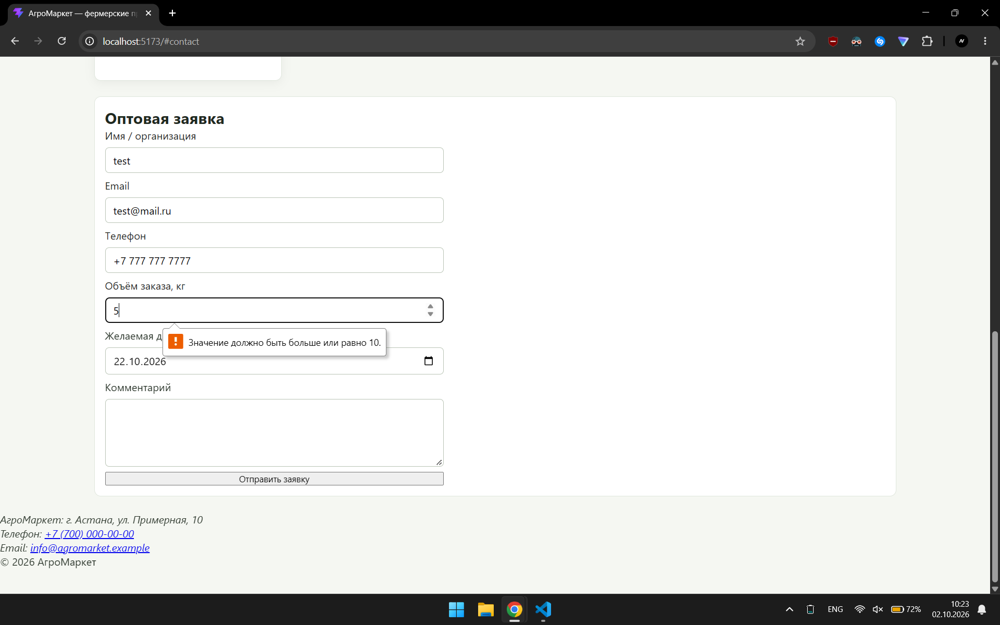
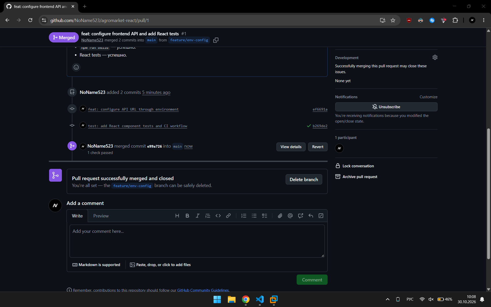

# АгроМаркет — React + Vite

## О проекте

AgroMarket — frontend маркетплейса сельскохозяйственных товаров. В приложении есть каталог с поиском, корзина и оптовая заявка; пользователи могут зарегистрироваться и войти, а интерфейс учитывает роли и предоставляет формы управления товарами соответствующим ролям.

Frontend построен на React 19 и Vite 8. Он обращается к backend через REST API; публичный адрес API задаётся переменной `VITE_API_URL`. Данные и бизнес-операции обслуживает backend.

## Установка и запуск

Из корня `agromarket-react` установите зависимости и запустите frontend:

```bash
npm ci
npm run dev
```

Откройте `http://localhost:5173`. Backend запускается отдельно; стандартный локальный API-адрес frontend — `http://localhost:3000/api`. При необходимости задайте другой публичный адрес через `VITE_API_URL` до сборки. Не помещайте туда пароли, JWT и другие секреты: значения `VITE_*` попадают в браузерный код. Подробности локального тестового окружения приведены в разделе ЛР12.

---

## Лабораторная работа 4 — вёрстка

### 1. Box model карточки

- content: 292.125 px
- padding: 0
- border: 0
- margin: 0
- итоговая ширина: примерно 292.125 px

При добавлении `box-sizing: border-box` ширина карточки не изменилась, потому что свойство уже применялось глобально через селектор `*`.


### 2. repeat(4, 1fr) на узком экране

При ширине около 500 px четыре фиксированные колонки становятся слишком узкими, карточки сжимаются, поэтому фиксированная сетка плохо подходит для адаптивной страницы.


### 3. auto-fit vs auto-fill

`auto-fit` схлопывает пустые колонки и позволяет существующим карточкам занимать освободившееся место.

`auto-fill` сохраняет место под возможные пустые колонки.

В проекте оставлен `auto-fit`.

### 4. Адаптивность

| Ширина | Колонок в каталоге | Где «Доставка» | Шапка |
|--------|---------------------|----------------|-------|
| 375 px | 1 | Под каталогом | Столбик |
| 768 px | 2–3 | Под каталогом | Ряд |
| 1280 px | Несколько колонок | Справа от каталога | Ряд |

#### 375 px


#### 1280 px


### 5. HTML5-валидация формы

Форма использует:

- `type="text"`;
- `type="email"`;
- `type="tel"`;
- `type="number"`;
- `type="date"`;
- `required`;
- `min="10"`.

Браузер автоматически блокирует отправку при некорректном email и при объёме заказа меньше 10 кг.



### 6. Что реализовано

- Семантические `header`, `nav`, `main`, `section`, `aside`, `footer`;
- отдельные компоненты `Header`, `Footer`, `ContactForm`;
- Flexbox для шапки, панели каталога и карточек;
- CSS Grid для каталога;
- `repeat(auto-fit, minmax(220px, 1fr))`;
- featured-карточка «Товар недели»;
- адаптивность mobile-first;
- media queries для 768px и 1024px;
- форма оптовой заявки;
- HTML5-валидация.

### 7. Запуск проекта

Инструкция ниже относится к первоначальному макету ЛР4. Для текущего fullstack-приложения используйте [установку и запуск проекта](#установка-и-запуск).

Команды выполняются из корня проекта.

Терминал 1:

```bash
npx json-server --watch db.json --port 3001
```

Терминал 2:

```bash
npm run dev
```

После этого проект открывается на: [http://localhost:5173](http://localhost:5173).

### Lighthouse Accessibility

Первичная проверка Lighthouse показала:

- Accessibility: 96/100
- замечание: недостаточный контраст текста и фона.

После корректировки цветов и повторной проверки:

- Accessibility: 100/100

Проблема контраста была устранена без изменения структуры страницы.


### Бонусные задания

Выполнено:

- Lighthouse Accessibility — 100/100;
- макет `.page` переписан через `grid-template-areas`;
- боковая панель «Доставка» на десктопе сделана `sticky`;
- шапка сделана `sticky`.

---

## Лабораторная работа 7 — вход, роли и бонусы

### Запуск

Backend должен работать на `http://localhost:3000`, а его PostgreSQL — в Ubuntu
VMware по адресу `<VM_HOST>:5432`. Frontend запускается из этого каталога:

```bash
npm install
npm run dev
```

Откройте `http://localhost:5173`. При необходимости задайте
`VITE_API_URL=http://localhost:3000/api` в локальном `.env`; значение по
умолчанию уже соответствует учебному стенду. Секреты в Vite-переменные не
помещайте: они попадут в браузерный код. Инструкция выше по запуску
`json-server` относится только к исторической ЛР4 и для ЛР7 не нужна.

### Вход и интерфейс

Форма [LoginForm](./src/components/LoginForm.jsx) переключается между входом и
регистрацией. После успешного ответа JWT хранится в `localStorage`, имя
пользователя появляется в шапке, доступна кнопка выхода. После F5 приложение
вызывает `GET /api/auth/me`: недействительный или просроченный токен удаляется,
показывается форма входа. Запросы выполняются через
[apiFetch](./src/api.js), который добавляет Bearer-токен и показывает ошибки API.

Каталог, поиск, счётчик корзины и форма оптовой заявки сохранены. Гость может
отправить заявку без входа. Заявка вошедшего пользователя связывается с его
аккаунтом и появляется в разделе «Мои заявки»; раздел не показывает чужие
заявки. Доступ к данным проверяется на backend, скрытие элементов интерфейса
само по себе защитой не считается.

Администратор дополнительно видит [AddProductForm](./src/components/AddProductForm.jsx),
кнопки удаления товаров и панель заявок. Добавление и удаление обновляют
каталог без перезагрузки. Удаление требует подтверждения. В панели можно
изменить статус заявки; пользователям без роли admin панель не показывается.
Для вошедших пользователей доступна форма смены пароля.

### Четыре бонуса

1. Мои заявки — `GET /api/orders/my` и связь новых заявок с аккаунтом.
2. Удаление товара — подтверждение и `DELETE /api/products/:id` для admin.
3. Смена пароля — форма и `PATCH /api/auth/password`.
4. Панель заявок — просмотр и изменение статуса для admin.

Сообщения 401 завершают сеанс и предлагают войти снова; сообщения 403
показываются рядом с действием. Пароли и JWT не записываются в журнал браузера.

### Проверки и снимки

Для ЛР7 `npm run lint` и `npm run build` прошли. Проверки записи в рабочую БД
для создания скриншотов не запускались. Существующие снимки в
[`screenshots/lab4/`](./screenshots/lab4/) относятся к ЛР4. Снимки ЛР7 ниже
показывают форму входа с вкладкой регистрации, интерфейс обычного пользователя
и административную форму товара. Пароли и JWT на них не видны.


Безопасная папка Postman Runner в backend завершилась с результатом
**20 passed, 0 failed, 0 skipped, 0 errors**. Проверки изменяющего CRUD на
рабочей базе этим результатом не подтверждаются.

---

## Лабораторная работа 8 — API и проверка окружения

The API address comes from `VITE_API_URL`. `.env.development` sets the local backend to `http://localhost:3000/api`; copy `.env.example` for another environment and set the public API URL before building. Vite variables are included in browser JavaScript, so never place passwords, JWT values, or other secrets in a `VITE_` variable.

```bash
npm ci
npm run dev
npm run lint
npm test
npm run build
```

The `apiFetch` helper continues to add the stored JWT and handle API responses. The `React CI` workflow runs install, lint, and build on Pull Requests and pushes to `main`. `LoginForm` has a component test for the registration-only name field.

### Скриншоты ЛР8



---

## Лабораторная работа 9 — production

Фактический URL сайта и ссылка на deployment: **требуют ручного заполнения**.
CI job `build` выполняет lint и сборку на Node 22. В Vercel задайте реальный
`VITE_API_URL` с HTTPS и суффиксом `/api` до сборки (переменная публичная).
Для Vite используются `npm run build` и каталог `dist`; `vercel.json` содержит
SPA rewrite. Точный Origin сайта нужно разрешить в CORS_ORIGIN backend;
Preview имеет отдельный Origin. После изменения VITE_API_URL нужна пересборка.
Защита main должна требовать проверку `build` (ранее job назывался `frontend`).
Локально 2026-11-06 lint и build прошли; публикация и проверка Preview не выполнялись.
Полные ответы и список ручных действий ЛР9 находятся в README репозитория
agromarket-server, в разделе «Продакшен».

---

## Лабораторная работа 10 — тестирование

### Запуск проверок

```bash
npm test
npm run coverage
npm run e2e
```

Vitest запускает unit- и component-тесты React в jsdom. React Testing Library проверяет интерфейс через роли и подписи, а mock API/fetch позволяют управлять ответами и проверять ошибки без настоящих запросов.

Playwright запускает E2E-сценарии в браузере. Read-only проверки открывают страницу и каталог. Сценарий регистрации и заказа помечен `@creates-order`: он создаёт пользователя и заявку, поэтому запускайте его только против явно выбранного тестового окружения. Для локального полного сценария укажите `E2E_BASE_URL` тестового frontend, связанного с тестовым API. Не направляйте этот сценарий на production.

### CI и E2E workflow

`React CI` выполняет `npm ci`, `npm run lint`, `npm run test:run` и `npm run build` при push в `main` и при pull request. Отдельный workflow Playwright запускает read-only smoke после успешного deployment, а также по расписанию и вручную. В последних двух случаях адрес берётся из GitHub repository variable `PRODUCTION_URL`. Регистрация, заказы и другие sensitive-сценарии в этот workflow не входят. При ошибке workflow сохраняет smoke-отчёты как artifacts.

### Краткие ответы для защиты

- **Зачем нужны component tests?** Они проверяют поведение отдельных компонентов и быстро локализуют регрессии интерфейса.
- **Зачем mock API?** Он даёт тесту предсказуемые успешные и ошибочные ответы без зависимости от сети, сервера и базы данных.
- **Зачем JWT-тесты?** Они проверяют, что сохранённый токен передаётся в `Authorization: Bearer ...` и защищённый запрос получает правильную авторизацию.
- **Зачем E2E?** Они проверяют ключевые пользовательские действия в работающем браузере и взаимодействие частей приложения.
- **Что показывает coverage?** Какая доля кода была выполнена тестами; высокий процент сам по себе не гарантирует правильность проверок.
- **Зачем CI?** Он автоматически запускает тесты, lint и сборку для изменений и обнаруживает ошибки до слияния.

## Бонусные задания ЛР10

1. **MSW (Mock Service Worker) — выполнено.** API-запросы в компонентных и API-тестах обрабатываются MSW handlers. Проверяются успешные ответы, ошибки API и заголовок `Authorization: Bearer ...` с JWT.
2. **Тестирование React-хуков — неприменимо.** В проекте нет собственных хуков `useAuth` или `useProducts`, поэтому искусственный хук не создавался.
3. **Мобильное E2E-тестирование — выполнено.** В конфигурации Playwright есть проект `Pixel 7`; тест проверяет видимость навигации и каталога на мобильном экране. Сценарий создания заказа пропускается в проекте Pixel 7.
4. **Порог покрытия — настроен.** В Vitest задан `coverage.thresholds.lines: 60`. При запуске `npm run coverage` покрытие Lines составило **90,44% (265/293)**. В отчёт входят исходники `src`, включая точку входа; тесты, тестовые вспомогательные файлы и генерируемые схемы исключены. HTML-отчёт находится в `coverage/index.html`. 100% не обязательно: выполнение каждой строки не гарантирует проверку всех вариантов поведения и корректность assertions. Текущий CI workflow запускает `npm run test:run`, lint и build, но не `npm run coverage`, поэтому сам порог пока не проверяется в CI.
5. **Безопасная уборка E2E-данных — проработано.** Для создания тестовых пользователей и заказов используется отдельная локальная тестовая БД. Очистка тестовых данных должна выполняться средствами тестового окружения. Neon используется для production; E2E-тесты не имеют права изменять или удалять в нём данные. Автоматическая очистка тестовых записей пока не реализована.

---

## Лабораторная работа 11 — безопасность frontend

### Архитектура и интеграция с API

Frontend построен на React 19 и Vite 8 как ESM-приложение. Компоненты каталога,
авторизации, товаров и заказов обращаются к backend через REST API. Общий клиент
`src/api.js` (`apiFetch`) формирует JSON-запросы, добавляет Bearer JWT для
авторизованных операций и преобразует сетевые и HTTP-ошибки в `ApiError`.
Публичный адрес API задаётся через `VITE_API_URL`; если переменная не задана,
используется `http://localhost:3000/api`. Значения `VITE_*` доступны в браузере,
поэтому секреты в них хранить нельзя.

### Общие Zod-схемы и синхронизация

Единственный источник общих схем — `shared/schemas/index.js` в backend-репозитории
`NoName523/agromarket-server`. Frontend синхронизирует именно этот файл по
закреплённому commit SHA `b01cd2adb29e5394e73671dbc2671580a4ea5466` и проверяет
SHA-256 `4A97D7D9345B7CFB2FFDA3B7E557D879EB5230C4575D27E2ED68857C0924176F`.
Скрипт разрешает только заданный репозиторий и путь, не использует fallback на
ветки `main`/`master` и записывает файл лишь после проверки хеша. Полученный
`src/generated/schemas.js` исключён из Git.

`npm run dev`, `npm run build` и `npm test` автоматически запускают
соответствующий lifecycle hook (`predev`, `prebuild`, `pretest`), который
выполняет `npm run schemas:sync` до команды. Отдельный запуск синхронизации:

```bash
npm run schemas:sync
```

Формы входа и регистрации используют `loginSchema` и `registerSchema`, а форма
добавления товара — `productSchema`. Проверка выполняется через `safeParse`; при
ошибке запрос не отправляется, а сообщение схемы показывается у поля. В API
отправляются нормализованные проверенные данные. Backend сохраняет собственную
обязательную проверку и не полагается на клиентскую валидацию.

### Безопасный вывод и обработка ошибок

Название товара выводится обычным JSX text rendering. Пользовательская строка
не интерпретируется как HTML; `dangerouslySetInnerHTML` для такого вывода не
используется. Регрессионный тест `src/components/ProductCard.test.jsx` проверяет
название ``: текст присутствует, внедрённого элемента
с `src="x"` и обработчика `onerror` нет, `alert` не вызывается.

`apiFetch` показывает понятную ошибку при недоступности сервера, некорректном
JSON и неуспешном HTTP-ответе. Формы авторизации и добавления товара отображают
ошибки API, а ошибки валидации — рядом с соответствующими полями.

### Команды разработки и проверок

Команды ниже определены в `package.json` и запускаются из корня frontend-проекта:

```bash
npm ci
npm run dev
npm run lint
npm test
npm run test:watch
npm run coverage
npm run test:coverage
npm run build
npm run e2e
npm run preview
npm run schemas:sync
```

`npm test` запускает Vitest в режиме однократного прогона; `npm run test:watch`
запускает Vitest в watch-режиме. `npm run coverage` и `npm run test:coverage`
выполняют Vitest с покрытием. Playwright E2E запускается командой
`npm run e2e`; конфигурация содержит проекты Chromium и Pixel 7. Сценарий
регистрации и создания заказа меняет данные, поэтому для него следует выбирать
только явно настроенное тестовое окружение, никогда production.

Команда `npm run build` собирает production-файлы Vite в `dist`. `npm run preview`
предназначена для локального просмотра уже собранного приложения. Фактические
результаты тестов зависят от конкретного запуска и здесь не заявляются.
Lifecycle hook синхронизации настроен для `npm test`, `npm run test:run` и `npm run coverage`.
Команды `test:watch` и `test:coverage` отдельных `pre*` hooks не имеют: в чистом
checkout перед ними сначала выполните `npm run schemas:sync`.

### Dependabot, Security Alerts и changelog

В `.github/dependabot.yml` задан еженедельный поиск npm-обновлений по понедельникам
в 09:00 (`Asia/Almaty`), с отдельными группами development и production
зависимостей и лимитом в пять открытых PR. Этот локальный файл сам по себе не
подтверждает, что настройки опубликованы на GitHub или что Dependabot уже
работает.

Dependabot Alerts и Dependabot Security Updates настраиваются отдельно в
**GitHub → Settings → Code security and analysis**. Их фактическое состояние
нужно проверить в настройках репозитория; наличие YAML не включает и не
подтверждает эти функции.

`CHANGELOG.md` содержит версию `1.0.0` в формате Keep a Changelog и отмечает
реализованные возможности frontend.

### Пять бонусов ЛР11

1. **Общие Zod-схемы.** Backend хранит единственный исходный модуль, frontend
   загружает его по закреплённому Git SHA и принимает только содержимое с
   ожидаемым SHA-256. Проверка: `npm run schemas:sync`, затем `npm test`.
2. **Защита входа по email.** Backend учитывает неудачные попытки для
   нормализованного email в PostgreSQL через HMAC, блокирует после десяти
   отказов на 60 секунд, обрабатывает параллельные запросы и сбрасывает счётчик
   после успешного входа. Frontend показывает полученную ошибку API. Проверка
   механизма выполняется backend unit- и интеграционными тестами; интеграционные
   тесты запускаются только с их безопасной тестовой БД.
3. **Dependabot.** В обоих проектах подготовлены локальные weekly npm-конфигурации
   с раздельными группами обновлений. Для работы обновлений и Security Alerts
   требуется проверить публикацию файлов и включить соответствующие функции в
   настройках GitHub.
4. **XSS-защита.** React отображает название товара как текст; тест
   `ProductCard.test.jsx` проверяет `` на отсутствие
   внедрённой разметки и выполнения обработчика. Проверка: `npm test`.
5. **Changelog.** Оба проекта имеют `CHANGELOG.md` с записью версии `1.0.0` в
   формате Keep a Changelog. Проверка — сверить записи с фактически реализованными
   возможностями в файлах changelog.

---

## Лабораторная работа 12 — Тестирование и качество

Frontend проверяется на нескольких уровнях: Vitest и React Testing Library
тестируют компоненты и пользовательские действия, MSW воспроизводит ответы API,
включая загрузку и ошибки. Playwright проверяет работу приложения в браузере:
каталог и страницу товара, регистрацию и вход, сценарии покупателя и фермера.
Проверки уровней описаны в разделе [Test Pyramid](#test-pyramid).

Локальные E2E фермера используют отдельную тестовую учётную запись роли `farmer`.
Setup входит через UI и сохраняет storageState для двух farmer-тестов. Тесты
создания данных допускаются только с локальным backend и отдельной тестовой БД;
подробности и подтверждение подключения — в разделе
[локального тестового окружения](#локальное-тестовое-окружение). Production smoke
отдельно проверяет реальный каталог и переход на страницу товара только запросами
чтения: [инструкция запуска](#production-smoke).

Локально ранее получены следующие результаты для соответствующих запусков:

- Vitest: **96 passed, 15 файлов**.
- Diagnostic E2E: **9 passed, 1 skipped**; sensitive E2E: **6 passed**.
- Accessibility: **4 проверки, 0 нарушений axe**.
- ESLint и production build прошли.

Это результаты отдельных локальных запусков, а не подтверждение статуса GitHub Actions
или всех последующих изменений. Актуальный результат определяется новым прогоном.

### Команды проверок

```bash
npm run lint                 # статическая проверка
npm run test:run             # однократный запуск Vitest
npm run coverage             # Vitest и отчёт V8 coverage
npm run e2e                  # локальные diagnostic и sensitive E2E
npm run e2e:smoke            # read-only smoke опубликованного сайта
npm run e2e:visual           # сравнение ProductCard с baseline
npm run e2e:visual:update    # явное обновление baseline после проверки изменений
npm run build                # production-сборка frontend
```

Компонентные и интеграционные тесты используют Vitest, React Testing Library и
MSW. Playwright включает accessibility-проверки axe-core по WCAG 2.1 A/AA и
визуальное сравнение ProductCard. Подробнее о запуске, отчётах и безопасном хранении
состояния — в [инструкциях тестирования](#тестирование-и-страница-товара) и
[visual regression](#visual-regression-productcard).

GitHub Actions CI настроен на Node.js 22, `npm ci`, lint, `test:run` и build.
Отдельный workflow запускает только read-only smoke после успешного deployment,
а также вручную и по расписанию. Настройка workflow сама по себе не подтверждает
успешное выполнение на GitHub.

### Бонусные задания ЛР12 — выполнены

1. **Покрытие кода (V8 Coverage) — выполнено.** Настроено измерение покрытия;
   фактический результат локального запуска — **90,44% (265 из 293 строк)**.
2. **Farmer Playwright storageState — выполнено.** Отдельный setup выполняет вход
   фермера через UI и сохраняет авторизованное состояние для E2E-тестов.
3. **GitHub Actions deployment smoke — выполнено.** Настроен read-only smoke после
   события `deployment_status`; проверка не создаёт и не изменяет данные.
   Успешное выполнение workflow на GitHub отдельно не подтверждено.
4. **Accessibility (axe-core) — выполнено.** Автоматизированные проверки WCAG 2.1
   A/AA дали **0 нарушений в четырёх проверках**. Автоматическая проверка не заменяет
   ручного аудита доступности.
5. **Visual regression — выполнено.** Добавлен baseline ProductCard; обнаружение
   намеренного визуального изменения проверено: **214 пикселей различий**.

### Тестирование и страница товара

ProductCard ведёт ссылкой на `/products/:id`; страница загружает товар через
`GET /api/products/:id` и показывает его название. Проверяйте прямое открытие URL
и переход из каталога.

#### Локальное тестовое окружение

Полные E2E, создающие пользователей, заказы или товары, запускайте только с
локальными frontend/backend и отдельной тестовой БД. До запуска подтвердите
фактическое подключение backend именно к этой БД; одного health endpoint
недостаточно. Не используйте рабочую БД или production.

#### Production smoke

`npm run e2e:smoke` проверяет опубликованный сайт чтением каталога и страницы
товара. Проверка не запускает регистрацию и не создаёт или изменяет данные;
методы записи блокируются сетевой политикой.

#### Visual regression ProductCard

`npm run e2e:visual` сравнивает карточку с baseline. Просмотрите diff перед
намеренным обновлением командой `npm run e2e:visual:update`.

### Test Pyramid

| Уровень | Что проверяется | Результат / число тестов | Время |
|---|---|---:|---:|
| Сервер: Supertest (ЛР8, ЛР11) | HTTP-маршруты, роли, валидация, авторизация и ошибки | Подтверждённые запуски: 28 security + 16 auth; наборы ЛР8 также описаны в историческом разделе | Security 6,76 с; auth 1,86 с в отдельных запусках |
| Клиент: Vitest + React Testing Library + MSW | Компоненты, действия пользователя и ответы API в jsdom | 96 passed, 15 файлов | В сохранённых результатах длительность не зафиксирована |
| E2E: Playwright локально | Критические пользовательские потоки в Chromium и Pixel 7 | Diagnostic: 9 passed, 1 skipped; sensitive: 6 passed | Diagnostic: 5,5 с; для sensitive длительность не подтверждена |
| Smoke: Playwright production | Реальный опубликованный каталог и переход к товару, только чтение | 2 smoke-сценария настроены; число успешных прогонов не подтверждено | Не подтверждено сохранённым результатом |

Значения взяты из известных локальных запусков и файлов проекта; время разных команд нельзя напрямую сравнивать. Состояние GitHub Actions отдельно не подтверждено.

### Наблюдения по тестированию

- Component и API-тесты закрепили состояния каталога loading/empty/ошибка, обработку HTTP 429 и 400 с `details`, блокировку кнопки во время входа и локальную проверку отрицательной цены без POST.
- Намеренно изменённый визуальный результат отличался от baseline на **214 пикселей**; тест обнаружил расхождение, baseline автоматически не обновлялся.
- Сохранённые Playwright trace-файлы есть. По их наличию нельзя достоверно утверждать конкретный диагноз без отдельного безопасного просмотра; выводы из trace здесь не приписываются.

### Лабораторная работа 12 — ответы на вопросы

1. **Зачем компонентные тесты и E2E?** Компонентные тесты быстро проверяют отдельные интерфейсы и состояния. E2E проходят ключевой пользовательский путь в настоящем браузере.
2. **Что показывает пирамида тестов?** Чем ниже уровень, тем тесты обычно быстрее и многочисленнее; серверные и клиентские проверки дополняются небольшим набором E2E и smoke.
3. **Зачем Vitest использует jsdom?** Он предоставляет тестам DOM-подобную среду без запуска полноценного браузера.
4. **Для чего React Testing Library?** Проверять интерфейс через доступные пользователю роли, подписи и действия, а не внутреннее устройство компонентов.
5. **Чем отличаются `getBy`, `queryBy` и `findBy`?** `getBy` синхронно требует один элемент; `queryBy` возвращает `null`, если элемента нет; `findBy` ожидает появления элемента асинхронно.
6. **Для чего MSW?** Перехватывать HTTP-запросы и задавать предсказуемые ответы API, включая ошибки, без реального backend.
7. **Зачем `resetHandlers` и очистка `localStorage`?** Возвращать общий тестовый контекст к исходному состоянию и не переносить handlers или сессию между тестами.
8. **Как Playwright auto-wait помогает тестам?** Locator assertions ждут нужного состояния элемента до timeout, уменьшая гонки с рендерингом.
9. **Зачем уникальный email через `Date.now()`?** Повторные регистрации не конфликтуют с записью, оставшейся в тестовой БД.
10. **Что такое smoke и как обезопасить production?** Smoke проверяет минимум критичных страниц. Production-набор ограничен read-only запросами; там нет регистрации и создания/изменения данных.
11. **Что означает HTTP 429 и как проверяется rate limit?** Сервер ограничил частоту запросов; тест проверяет статус и отображение понятной ошибки без обхода ограничения.
12. **Зачем build в CI?** Он подтверждает, что production-сборка создаётся после lint и тестов; локально зелёный результат сам по себе не доказывает успешность CI на GitHub.
13. **Как искать CI-only ошибку и защищать main?** Сверить Node и команды CI, артефакты и логи упавшего job, повторить минимальный сценарий локально. Защитить `main` обязательными checks и изменениями через Pull Request.

### Использование ИИ

ИИ помогал готовить тесты и диагностировать ошибки тестовой инфраструктуры. Изменения проверялись тестами и сверялись с проектом; выводы из недоступных или непроверенных отчётов не заявляются.
